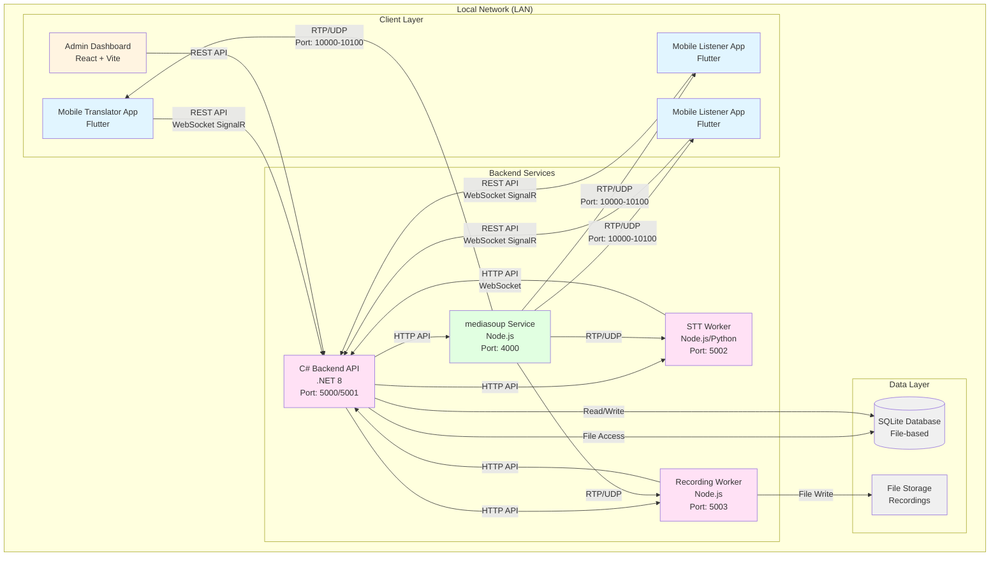
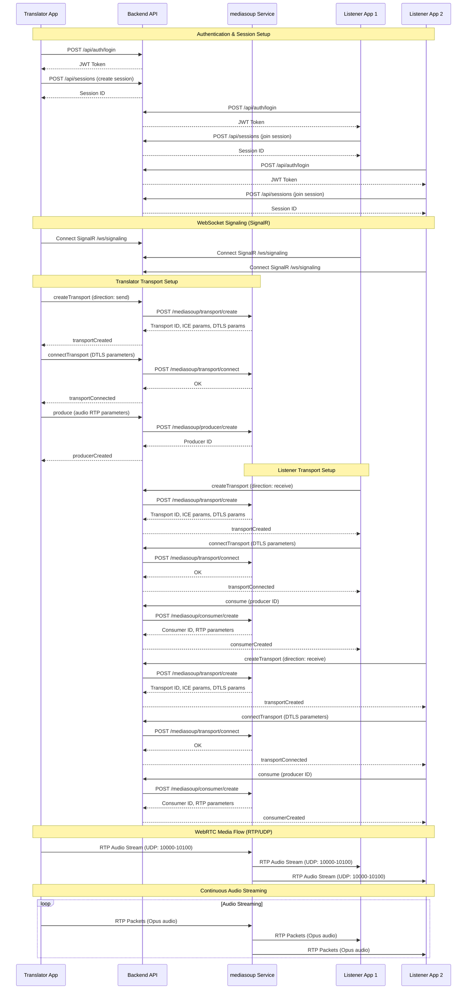
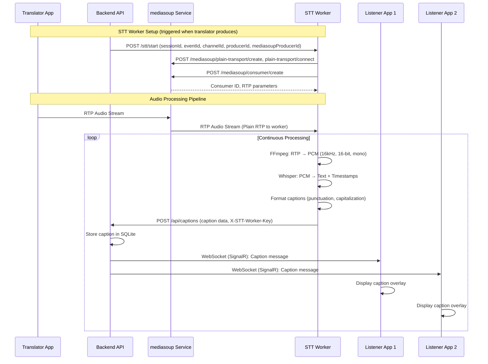
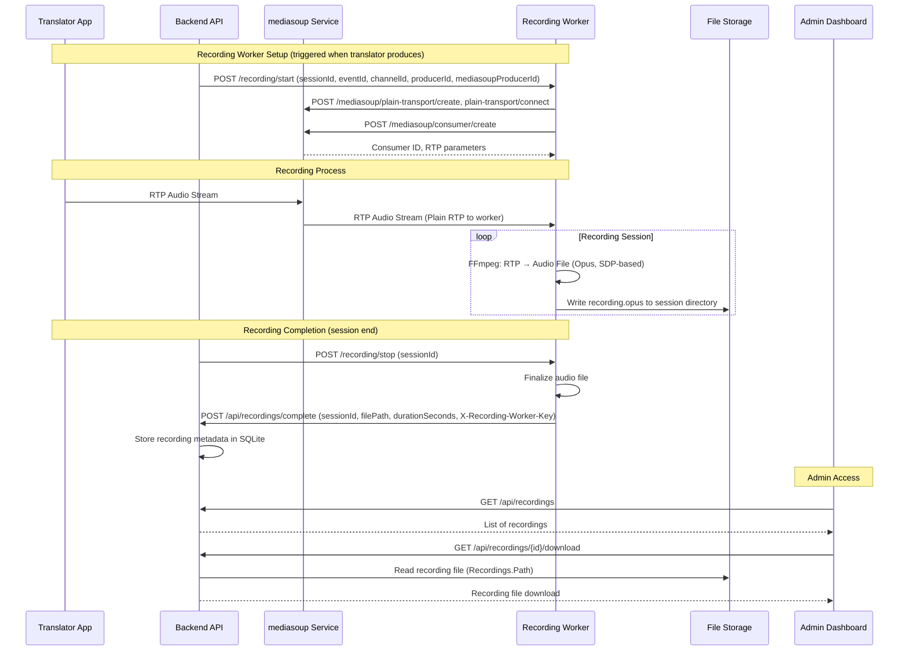
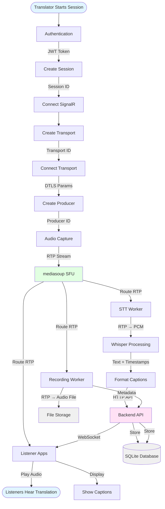
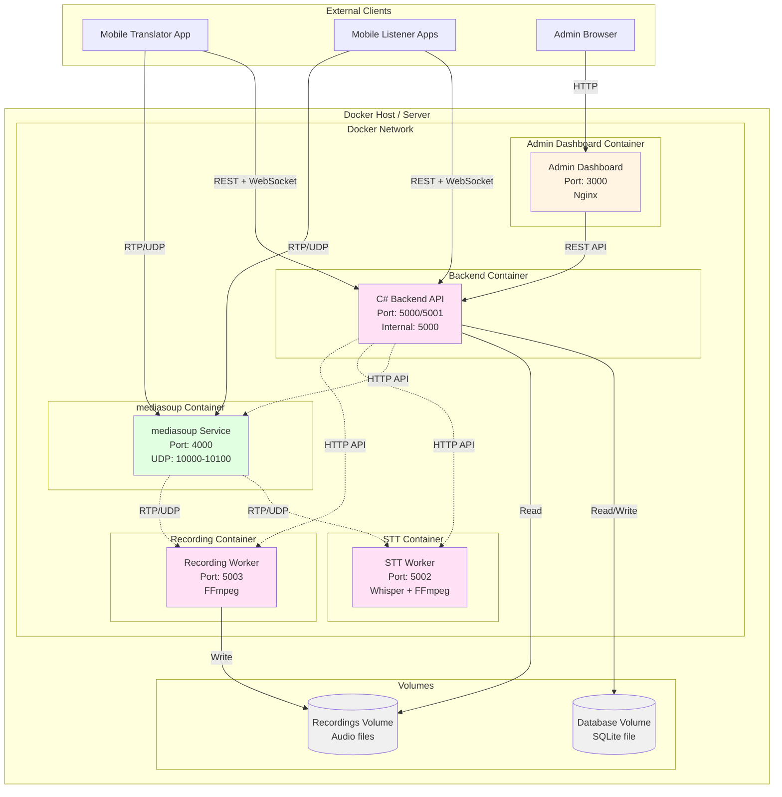
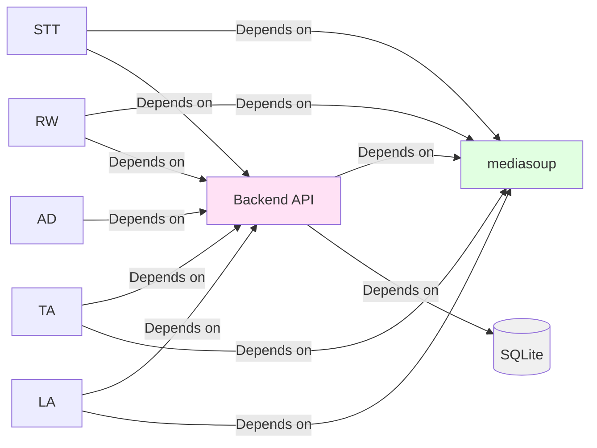

# Audio Translation System - Architecture Overview

This document provides comprehensive architecture diagrams showing how all services interact with each other in the real-time audio translation/broadcast system.

## Table of Contents

1. [High-Level System Architecture](#high-level-system-architecture)
2. [Service Interaction Flow - Audio Streaming](#service-interaction-flow---audio-streaming)
3. [Service Interaction Flow - STT/Captions](#service-interaction-flow---sttcaptions)
4. [Service Interaction Flow - Recording](#service-interaction-flow---recording)
5. [Data Flow Diagram](#data-flow-diagram)
6. [Deployment Architecture](#deployment-architecture)
7. [Service Communication Protocols](#service-communication-protocols)

---

## High-Level System Architecture

---

## Service Interaction Flow - Audio Streaming

This diagram shows the complete flow when a translator starts streaming audio and listeners receive it.

---

## Service Interaction Flow - STT/Captions

This diagram shows how audio is processed for speech-to-text and captions are delivered to listeners. The backend starts the STT worker when the translator creates a producer (starts streaming). The STT worker connects to mediasoup via **Plain RTP transport** (plain-transport/create, plain-transport/connect, then consumer/create).

---

## Service Interaction Flow - Recording

This diagram shows how audio recordings are captured and managed. The backend starts the recording worker when the translator creates a producer (starts streaming). The recording worker connects to mediasoup via **Plain RTP transport** (plain-transport/create, plain-transport/connect, then consumer/create). Recordings are written to file storage; the backend serves downloads by reading from the same path (shared volume or local disk).

---

## Data Flow Diagram

This diagram shows the complete data flow through the system for a typical translation session.

---

## Deployment Architecture

This diagram shows how services are deployed using Docker containers.

---

## Service Communication Protocols

### Port Configuration

| Service | Port | Protocol | Purpose |
|---------|------|----------|---------|
| C# Backend API | 5000 | HTTP | REST API endpoints |
| C# Backend API | 5001 | HTTPS | REST API (if TLS enabled) |
| C# Backend WebSocket | 5000/5001 | WebSocket (SignalR) | Real-time signaling |
| mediasoup Service | 4000 | HTTP | mediasoup API |
| mediasoup RTP | 10000-10100 | UDP | RTP media streams |
| STT Worker | 5002 | HTTP | STT worker API (POST /stt/start, POST /stt/stop) |
| Recording Worker | 5003 | HTTP | Recording worker API (POST /recording/start, POST /recording/stop) |
| Admin Dashboard | 3000 | HTTP | Web dashboard |

### Communication Patterns

#### 1. REST API (HTTP)
- **Backend ↔ Mobile Apps**: Authentication, session management, event/channel CRUD
- **Backend ↔ Admin Dashboard**: All CRUD operations, monitoring
- **Backend ↔ mediasoup**: Transport/producer/consumer creation
- **Backend ↔ STT Worker**: Caption submission, status updates
- **Backend ↔ Recording Worker**: Recording control (start/stop), completion callback (POST /api/recordings/complete)

#### 2. WebSocket (SignalR)
- **Backend ↔ Mobile Apps**: Real-time signaling (transport creation, producer/consumer setup)
- **Backend ↔ Mobile Apps**: Caption delivery to listeners
- **Backend ↔ Admin Dashboard**: Real-time session monitoring (optional)

#### 3. RTP/UDP (WebRTC and Plain RTP)
- **Mobile Apps ↔ mediasoup**: Audio streaming via WebRTC transports (Opus codec)
- **mediasoup ↔ STT Worker**: Audio feed via Plain RTP transport (worker creates plain-transport, then consumer)
- **mediasoup ↔ Recording Worker**: Audio feed via Plain RTP transport (same pattern)

#### 4. File System
- **Backend ↔ SQLite**: Database file access (file-based, no network protocol)
- **Recording Worker ↔ File Storage**: Audio file writes (recordings directory)
- **Backend ↔ File Storage**: Audio file reads for downloads (same Recordings.Path; no request to Recording Worker)

### Service Dependencies

### Message Flow Summary

1. **Authentication Flow**: Client → Backend (REST) → JWT Token
2. **Session Creation**: Client → Backend (REST) → Session ID
3. **Signaling Flow**: Client ↔ Backend (WebSocket/SignalR) ↔ mediasoup (HTTP)
4. **Media Flow**: Client ↔ mediasoup (RTP/UDP via WebRTC); Workers ↔ mediasoup (Plain RTP)
5. **Caption Flow**: Backend → STT Worker (POST /stt/start when producer created); STT Worker → Backend (POST /api/captions) → Listeners (SignalR)
6. **Recording Flow**: Backend → Recording Worker (POST /recording/start, POST /recording/stop); Recording Worker → File Storage (writes); Recording Worker → Backend (POST /api/recordings/complete); Admin → Backend (GET /api/recordings, GET /api/recordings/{id}/download); Backend serves file from File Storage

---

## Key Architectural Decisions

### 1. **SFU Architecture (mediasoup)**
- Uses Selective Forwarding Unit (SFU) instead of MCU
- Reduces server CPU load by routing streams without transcoding
- Enables efficient one-to-many audio distribution

### 2. **Separation of Concerns**
- **Backend API**: Authentication, authorization, orchestration, state management
- **mediasoup**: Media routing only (no business logic)
- **STT Worker**: Isolated transcription processing
- **Recording Worker**: Isolated recording processing

### 3. **File-based Database (SQLite)**
- No separate database server required
- Simplified deployment
- Suitable for LAN-only, single-server deployments
- Can migrate to PostgreSQL if needed for scale

### 4. **Worker Pattern**
- STT and Recording workers are separate services
- Can scale independently
- Can restart without affecting other services
- Isolated failure domains

### 5. **Real-time Communication**
- WebSocket (SignalR) for signaling (low latency, bidirectional)
- RTP/UDP for media (low latency, optimized for real-time)
- REST API for CRUD operations (simpler, stateless)

---

*Last Updated: February 9, 2026*
